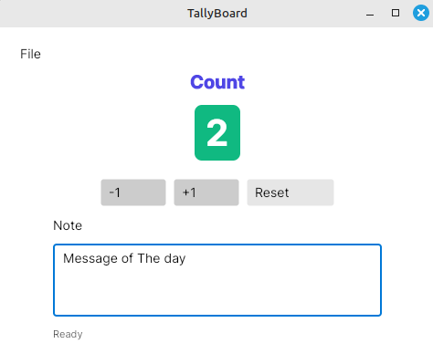

<p align="center">
  
</p>


## TallyBoard

Desktop counter with notes. Built with Avalonia on .NET 8. Runs on Linux, macOS, Windows.

#### TallyBoard application provides following features:
+ Increment/decrement counter
+ Reset to zero
+ Optional note attached to the current tally
+ State saved to a local file


TallyBoard App Youtube Page - [Visit Website](https://www.youtube.com/@damirbubanovic6608)


## Prerequisites
+ .NET SDK 8
+ Git (optional but recommended)
+ VS Code with “C#” and “C# Dev Kit” extensions


## Getting Started
```bash
# build
dotnet build
# run
dotnet run --project TallyBoard.App
```


## Creator Self Promo Links

Damir Bubanović

- **[DamirBubanovic.com](https://damirbubanovic.com/)**
- **[Youtube.com](https://www.youtube.com/@damirbubanovic6608)**
- **[GitHub](https://github.com/damir-bubanovic)**
- **[StackOwerflow](https://stackoverflow.com/users/11778242/damir-bubanovic)**
- **[Yahoo](damir.bubanovic@yahoo.com)**

## Acknowledgments

* Hat tip to anyone whose code was used including ChatGPT
* Inspiration
* etc